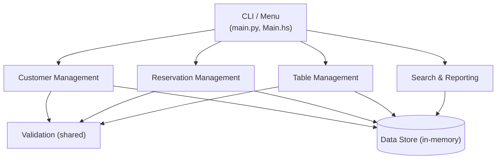
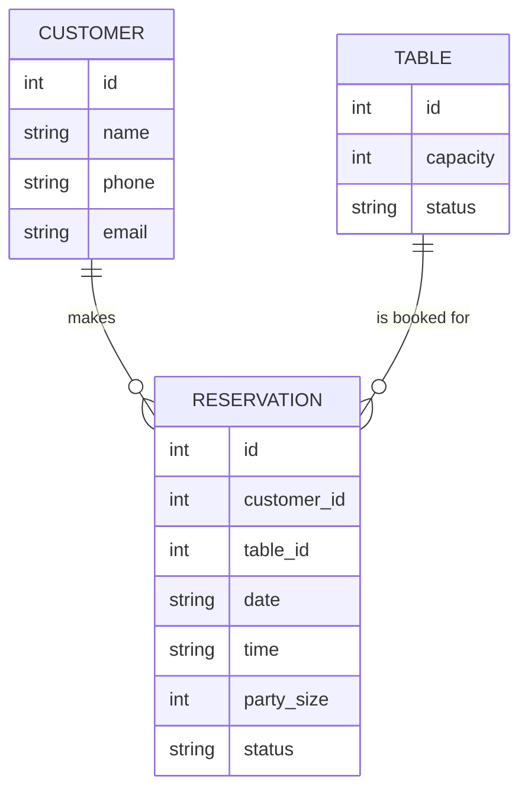
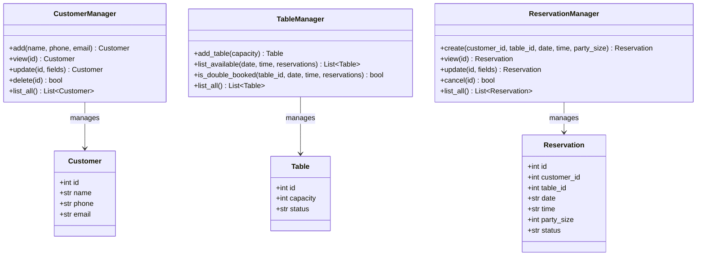
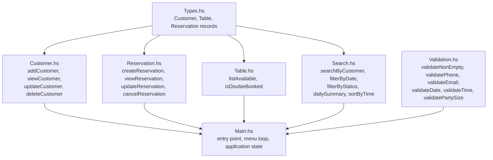
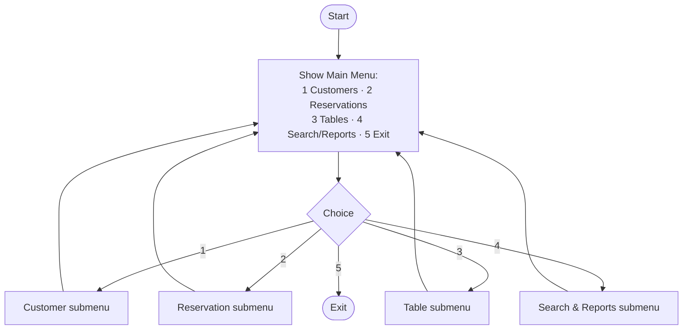
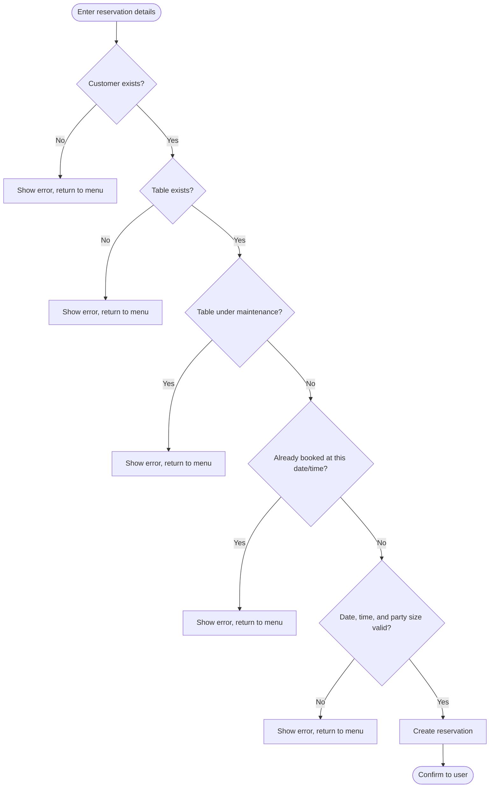

# Project Structure & Diagrams

Shared design reference for Report.md sections 3.2 (Architecture / Module Structure), 3.3 (Data Structures Used), and 3.4 (Flowchart / Pseudocode / Class Diagram). Update this file as the design evolves; the final report text in [Report.md](../../Report.md) should summarize it and link back here.

## Repository Layout

Deliberately flat: plain scripts/modules, no packages, no build tooling beyond what each language needs at minimum. Python needs nothing but the interpreter; Haskell runs with `runghc` (no cabal/stack project). This keeps the code itself small so the group's effort goes into the paradigm comparison, not project plumbing.

```
RestaurantReservation-PythonHaskell/
├── Report.md
├── README.md
├── python/
│   ├── main.py           # entry point, menu-driven CLI
│   ├── customer.py       # Customer model + CustomerManager        (Member 2)
│   ├── reservation.py    # Reservation model + ReservationManager  (Member 1)
│   ├── table.py          # Table model + TableManager (availability, double-booking) (Member 3)
│   ├── search.py         # search / filter / reporting             (Member 4)
│   └── validation.py     # shared input validation
├── haskell/
│   ├── Main.hs            # entry point, IO loop / menu
│   ├── Types.hs           # Customer, Reservation, Table data types
│   ├── Customer.hs        # pure customer CRUD functions       (Member 2)
│   ├── Reservation.hs     # pure reservation CRUD functions    (Member 1)
│   ├── Table.hs           # availability, double-booking check (Member 3)
│   ├── Search.hs          # search / filter / reporting        (Member 4)
│   ├── Validation.hs      # shared input validation
│   └── SearchTest.hs      # standalone manual test harness for Search.hs (Member 4); run with `runghc SearchTest.hs`
└── docs/
    ├── design/                  # this file and other shared design notes
    └── modules/                 # one working file per member/module
```

Each same-named file pair (`python/reservation.py` <-> `haskell/Reservation.hs`) maps 1:1 to a report section and a group member's task, so the module split doubles as the writing assignment.

## Module Responsibility Map

| Module | Owner | Python | Haskell | Working doc |
|---|---|---|---|---|
| Reservation | Member 1 | `reservation.py` | `Types.hs` (Reservation), `Reservation.hs` | [modules/reservation.md](../modules/reservation.md) |
| Customer | Member 2 | `customer.py` | `Types.hs` (Customer), `Customer.hs` | [modules/customer.md](../modules/customer.md) |
| Table | Member 3 | `table.py` | `Types.hs` (Table), `Table.hs` | [modules/table.md](../modules/table.md) |
| Search & Reporting | Member 4 | `search.py` | `Search.hs` | [modules/search-reporting.md](../modules/search-reporting.md) |
| Validation | shared | `validation.py` | `Validation.hs` | n/a |
| Entry point | shared | `main.py` | `Main.hs` | n/a |

Note: there's no separate "assign table to reservation" function; assignment just *is* creating/updating a `Reservation` with a `table_id`, after `Table`'s availability check passes. Keeping that as one step (rather than a create step plus a separate assign step) removes a class of bugs where the two could get out of sync.

---

## Diagrams (Text Form)

### 1. High-Level Architecture



### 2. Data Relationship (ER-style)


One customer -> many reservations. One reservation -> exactly one table. A table can only hold one active reservation per date/time slot (this constraint is what the double-booking check enforces).

**Note:** in the actual code, `Table`/`table.py` does **not** store an `is_booked` flag. Availability is computed on demand by `TableManager.list_available()`/`is_double_booked()` (Python) and `Table.listAvailable`/`isDoubleBooked` (Haskell) by scanning the reservations list for an active reservation on the same table/date/time. This avoids having two pieces of state (the flag and the reservations list) that could drift out of sync.

### 3. Python Class Diagram (OOP)



### 4. Haskell Module/Type Diagram (FP)


Key contrast to note in the report: Python's managers hold mutable state (`self.reservations`); Haskell's functions are pure and return a new `[Reservation]` list rather than mutating one. State threading happens in `Main.hs` via `IORef`.

### 5. Main Menu Flowchart



### 6. Create-Reservation Flow (validation + double-booking)


