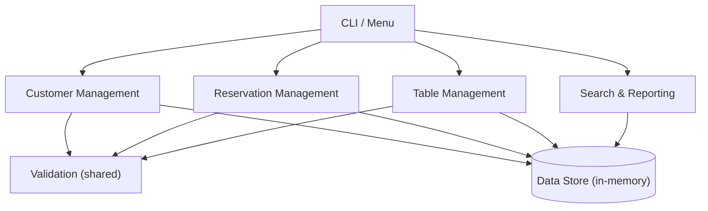
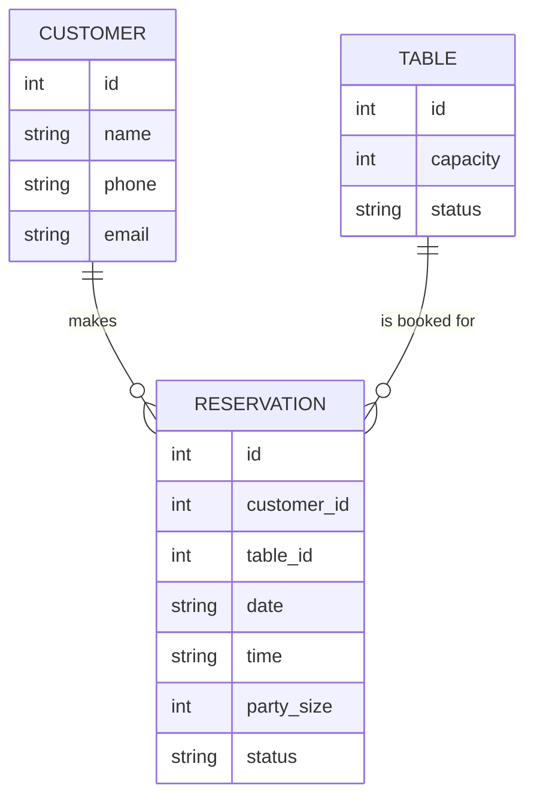
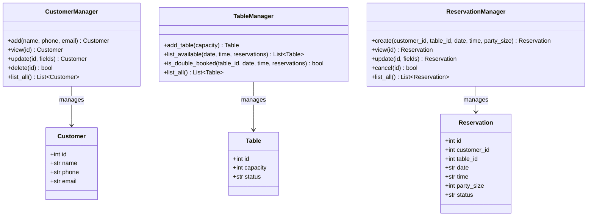
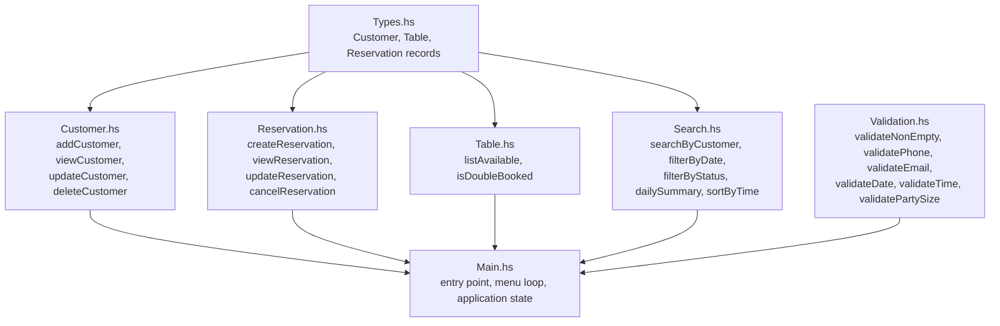
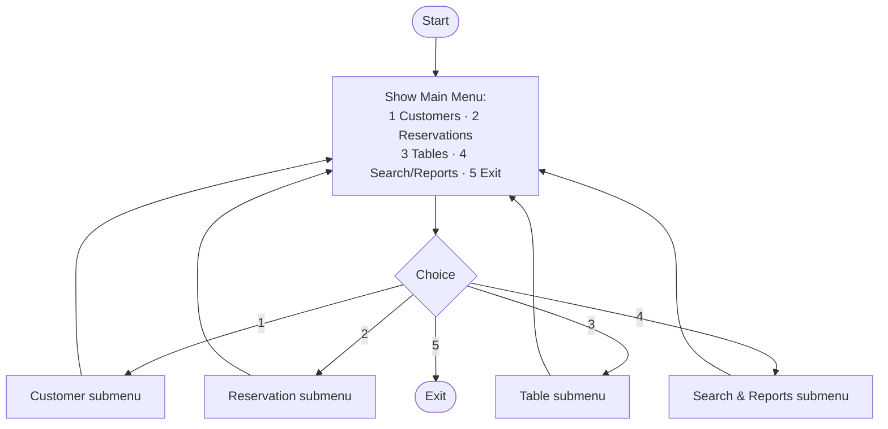
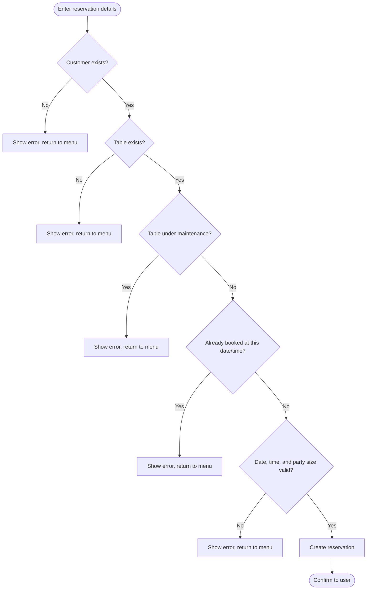

## 3.0 Design

### 3.1 System Overview

The system uses a menu-driven console interface on top of four functional areas (Customer Management, Reservation Management, Table Management, and Search & Reporting) plus a shared input-validation layer. Both implementations expose the same menu structure and the same functional areas; only the internal representation of data and state differs between the two.

Data is held entirely in memory for the lifetime of a single run: customers, reservations, and tables are created, modified, and queried through the menu, and nothing is written to disk.

### 3.2 Architecture / Module Structure

Each functional area is implemented as one file per language:

```
python/
├── main.py           entry point, menu-driven CLI
├── customer.py        Customer record + customer operations
├── reservation.py     Reservation record + reservation operations
├── table.py           Table record + availability / double-booking logic
├── search.py           search, filter, and reporting operations
└── validation.py        shared input validation

haskell/
├── Main.hs             entry point, menu / IO loop
├── Types.hs             Customer, Reservation, Table data types
├── Customer.hs           customer operations
├── Reservation.hs        reservation operations
├── Table.hs               availability / double-booking logic
├── Search.hs               search, filter, and reporting operations
└── Validation.hs           shared input validation
```

The layout is deliberately flat: each language uses plain source files with no package hierarchy, and the Haskell side needs no build tool beyond the compiler (it runs directly with `runghc`). This keeps the two implementations easy to compare file-for-file: `reservation.py` and `Reservation.hs` cover exactly the same responsibility, for example.

### 3.3 Data Structures Used

**Customer**: a record with an ID, name, phone number, and email address.

**Table**: a record with an ID, seating capacity, and a status of either *Active* or *Under Maintenance*.

**Reservation**: a record with an ID, the linked customer ID and table ID, a date, a time, a party size, and a status of either *active* or *cancelled*.

In the Python implementation, all three are represented as dataclasses, held in manager classes that store them in a dictionary keyed by ID and mutate that dictionary in place. In the Haskell implementation, all three are immutable record types, held simply as plain lists (`[Customer]`, `[Reservation]`, `[Table]`) that are threaded through the program as an application state value; operations produce a new list rather than modifying an existing one.

Table availability is not stored as a flag on the table itself. Instead, a table is considered booked at a given date and time if the list of reservations contains an active reservation for that table at that date and time. Computing availability this way, from the reservation list, rather than keeping a separate "booked" flag in sync with it, means the two pieces of state cannot drift apart.

### 3.4 Flowchart / Pseudocode / Class Diagram

**Figure 3.1: High-level architecture**



**Figure 3.2: Data relationship**



One customer may have many reservations; one reservation refers to exactly one table. A table can hold at most one active reservation per date/time slot. This is the invariant the double-booking check enforces.

**Figure 3.3: Python class diagram (OOP)**



**Figure 3.4: Haskell module / type diagram (FP)**



**Figure 3.5: Main menu flowchart**



**Figure 3.6: Create-reservation flow (validation and double-booking check)**



### 3.5 Input and Output Design

Input consists of menu selections (single digits) and free-text field values entered one prompt at a time: customer name/phone/email; table capacity/status; reservation customer ID, table ID, date, time, and party size; and search/filter criteria. Output consists of confirmation messages, validation error messages, formatted listings of customers, tables, and reservations, and search/report results.

### 3.6 Design Notes: Python (OOP)

The Python implementation groups each entity's data and behaviour into a class: a plain data class holds the record's fields, and a manager class (`CustomerManager`, `ReservationManager`, `TableManager`) owns a dictionary of records and exposes methods (`add`/`create`, `view`, `update`, `delete`/`cancel`, `list_all`) that read and mutate that dictionary directly. Validation is performed by shared functions in `validation.py`, called from inside the relevant manager method before a record is created or changed; invalid input raises a `ValidationError`, which the menu layer catches and reports.

### 3.7 Design Notes: Haskell (FP)

The Haskell implementation represents each entity as an immutable record type in `Types.hs`, with no manager objects and no internal mutable state. Each module (`Customer.hs`, `Reservation.hs`, `Table.hs`) exposes pure functions that take the current list of records (and any other needed arguments) and return a new list, rather than modifying anything in place. The one piece of mutable state in the whole program (the current customers, reservations, tables, and ID counters) is held in a single `IORef` in `Main.hs`, which the menu loop reads and updates between prompts. Validation functions in `Validation.hs` return `Either String a`: `Left` with an error message, or `Right` with the validated value, so a caller must handle both outcomes explicitly rather than relying on an exception being caught elsewhere.
